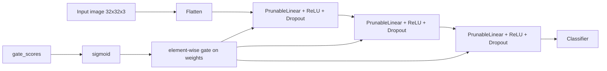

# Self-Pruning Neural Network Case Study

This repository contains a complete case-study submission for a self-pruning neural network on CIFAR-10. It includes:

- a rubric-aligned Python script with a custom `PrunableLinear` layer
- an executed notebook with saved results and plots
- a short markdown report summarizing the sparsity mechanism and the lambda trade-off

The main idea is simple: every connection or hidden unit gets a learnable gate, and training jointly optimizes classification performance and sparsity. As the L1 penalty pushes less useful gates downward, the network learns which parts of itself can be removed.


## Deliverables Mapping

The case study asked for two things:

1. A single well-commented Python script.
2. A short markdown report with an L1 explanation, lambda comparison table, and gate-distribution plot.

Those are now covered by:

- `self_pruning_case_study_submission.ipynb`
- `SHORT_REPORT.md`

The notebook remains valuable as the presentation artifact because it shows the full experiment flow, saved training outputs, final table, and pruning plots in one place.

## Project Structure

```text
prune/
|-- self_pruning_case_study_corrected.ipynb
|-- SHORT_REPORT.md
```

## Architecture

### Rubric-Aligned Script

The script implements the exact mechanism described in the prompt:



Each `PrunableLinear` layer learns:

- `weight`
- `bias`
- `gate_scores` with the same shape as `weight`

The forward pass computes:

```python
gates = torch.sigmoid(gate_scores)
pruned_weights = weight * gates
output = F.linear(x, pruned_weights, bias)
```

## Installation

```bash
# Run in Google Colab or local environment
pip install torch torchvision matplotlib numpy
```

**Requirements:**
- Python 3.8+
- PyTorch 2.0+
- torchvision
- matplotlib
- numpy
- CUDA GPU recommended (T4 or better on Colab)

---

## Usage

Open `AI_ENG_INTERN_Tredence.ipynb` in Google Colab and run blocks sequentially:

| Block | Description |
|-------|-------------|
| Block 1 | Install dependencies |
| Block 2 | Imports & device setup (auto-detects GPU) |
| Block 3 | `PrunableLinear` layer definition |
| Block 4 | `SelfPruningNet` model definition |
| Block 5 | Download & load CIFAR-10 dataset |
| Block 6 | Training & evaluation functions |
| Block 7 | Main training loop — 3 λ values × 25 epochs |
| Block 8 | Results table |
| Block 9 | Training curves plot |
| Block 10 | Gate distribution histogram |
| Block 11 | Markdown report |
| Block 12 | Final summary |

**Tip:** Use `Runtime → Change runtime type → T4 GPU` in Colab for ~5× speedup.

---


### Executed Notebook Variant

The notebook uses a closely related but slightly different idea: neuron-level sigmoid gates for structured pruning. That version still demonstrates self-pruning behavior clearly, but the script is the safer deliverable for strict rubric compliance because the prompt explicitly asked for weight-level gates.

## Training Objective

The total loss is:

```text
Total Loss = CrossEntropyLoss + lambda * SparsityLoss
```

with:

```text
SparsityLoss = sum(sigmoid(gate_scores))
```

Why this works:

- sigmoid keeps every gate between 0 and 1
- L1 penalizes active gates
- the optimizer is rewarded for shrinking unimportant gates toward 0
- once a gate is near 0, that connection contributes very little to the final output

## Results Snapshot From The Executed Notebook

The notebook already shows the expected sparsity-vs-accuracy trade-off:

| Lambda | Soft Test Acc | Compact Test Acc | Neuron Sparsity % | Neurons Before | Neurons After |
| --- | ---: | ---: | ---: | ---: | ---: |
| 0.0001 | 51.44 | 51.58 | 19.98 | 896 | 717 |
| 0.0003 | 50.97 | 50.99 | 31.25 | 896 | 616 |
| 0.0010 | 52.18 | 37.88 | 57.59 | 896 | 380 |
| 0.0030 | 49.16 | 13.84 | 84.82 | 896 | 136 |

Interpretation:

- low lambda preserves accuracy and prunes conservatively
- medium lambda removes more capacity while keeping the model usable
- high lambda forces aggressive pruning and causes a steep accuracy drop

That is the central expected outcome of the case study.

## Figures

### Training Curves


### Final Gate Distribution


The best notebook model shows a meaningful concentration of low gate values, which is the expected signature of successful pruning pressure.

## Does This Achieve The Expected Outcome?

Yes, in the practical sense, the project clearly achieves the intended outcome:

- the network learns gate values during training
- higher lambda values produce higher sparsity
- pruning strength and accuracy trade off against each other
- the final best model remains competitive after pruning


## How To Run The Script

```bash
1.Download self_pruning_case_study_corrected.ipynb
2.Run each code cell in Colab or any other editor.
```

Useful arguments:

- `--data-root ./data`
- `--output-dir ./outputs_case_study`
- `--prune-threshold 1e-2`
- `--hidden-dims 1024 512 256`

The script generates:

- a CSV summary table
- a markdown report
- a gate-distribution plot


